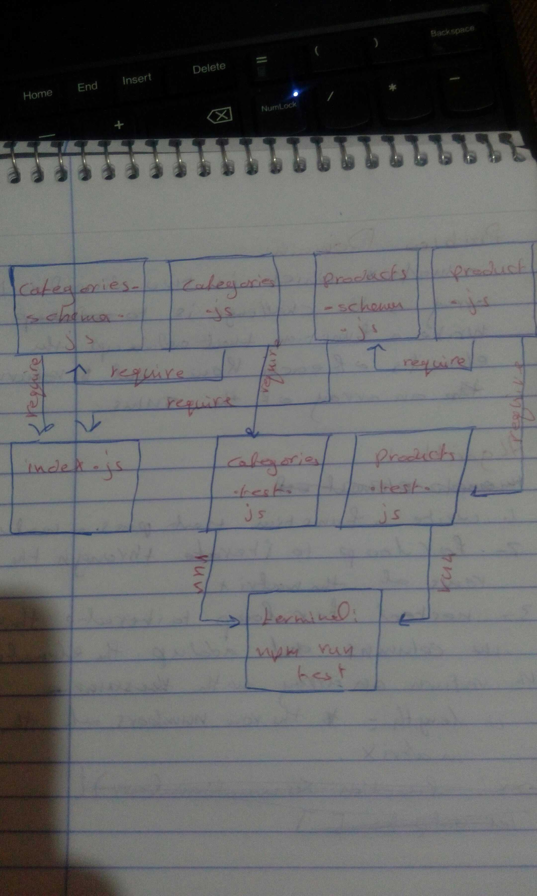

# LAB - Class 05

##  Data Modeling With NoSQL Databases

### Author: Saja Swalgah

### Links and Resources

- [submission PR](https://github.com/Saja-401-advanced-javascript/class-05/pull/1)
- [ci/cd](https://github.com/Saja-401-advanced-javascript/class-05/actions/runs/31643361) 

#### How to initialize/run your application (where applicable)

-  `npm run start`

#### Tests

- How do you run tests?  npm run test

#### UML

